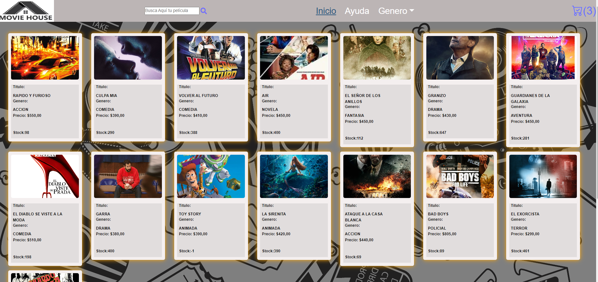
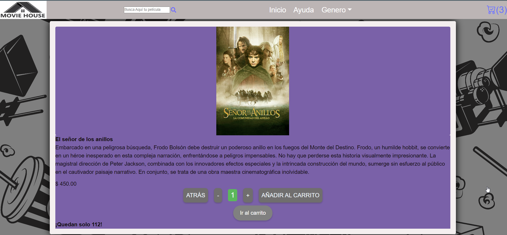

# Moviehouse
Es una aplicacion web, diseñada para realizar la compra de peliculas en formato VHS y DVD.
Actualmente contamos con la aplicacion 100% operativa, en la cual prestamos un servicio de excelencia a la hora 
de que necesites pasar esos días donde queres descansar y disfrutar, cuantas veces quieras, de esas peliculas que no te cansas de ver.

## Table of Contents
1. [Info General](#info-general)
2. [Technologías](#technologias)
3. [Instalación](#instalacion)
4. [Colaboración](#colaboracion)
5. [FAQs](#faqs)
### Info General
***
Está desarrollada integramente en React, donde se utilizó en el desarrollo NodeJS para la ejecución de paquetes por línea de comando.
React soportado por Vite, cuenta con las actualizaciones requeridas en el desarrollo de paginas, para hacer que lo empleado en el desarrollo, sea lo último disponible.

### Screenshot


## Technologies
***
Listado de tecnologias usadas en el proyecto:
* [Nombre de Technologia]NodeJS: (https://nodejs.org/es) Version 20.1.0 
* [Nombre de libreria]Boostrap: (https://getbootstrap.com/) Version 5.3.1.
* [Herramienta de apoyo](https://vitejs.dev/)
## Instalacion
***
De esta maneras lograras la instalacion del proyecto. 
```
$ git clone https://github.com/MattWolf79/MovieHouse
$ cd ../path/to/the/file
$ npm install
$ npm start
```

## Colaboración
***
Con la colaboracion de CODERHOUSE y Claro Argentina, se logró el desarrollo y diseño de la Ecommerce.
## FAQs
***
1. **Para qué sirve?**
Sirve para poder comprar peliculas. 
2. **Es recomendable y segura?**
* Segura
* Rápida
* Útil
